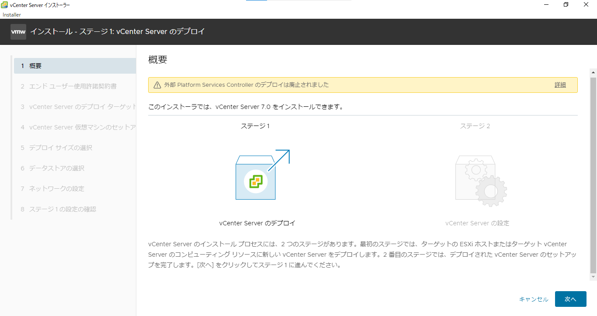
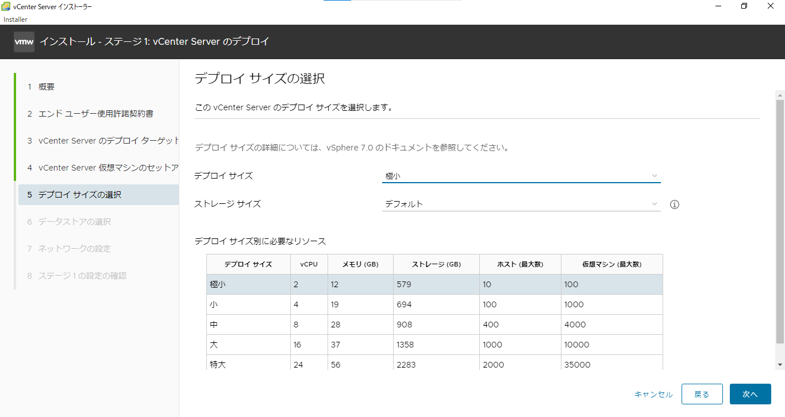
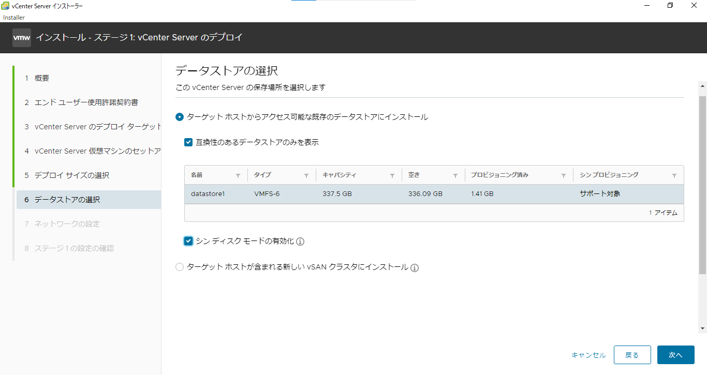
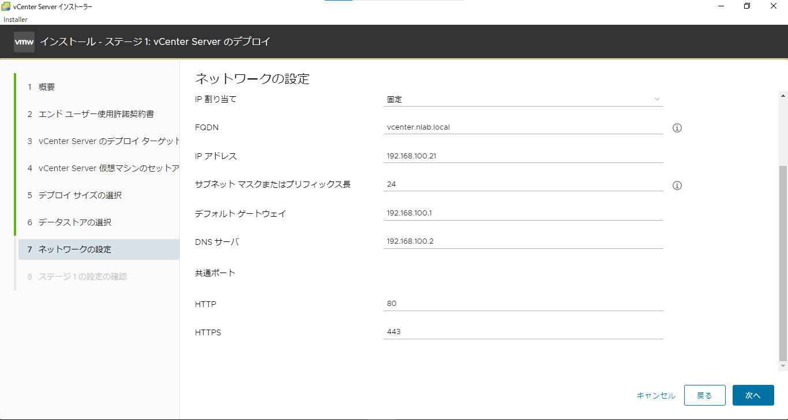
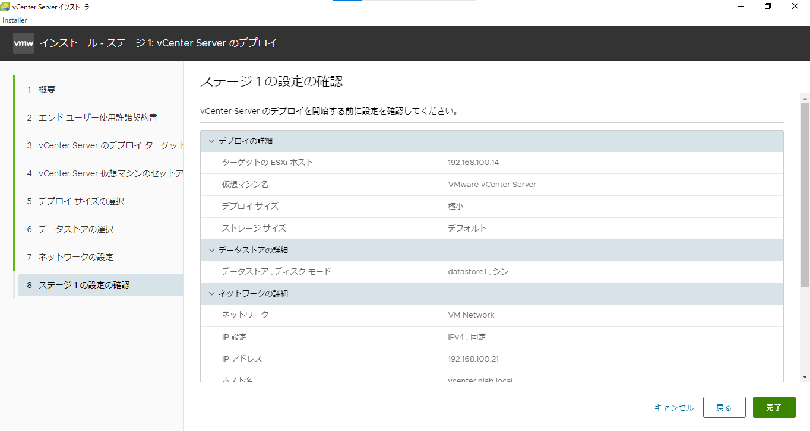
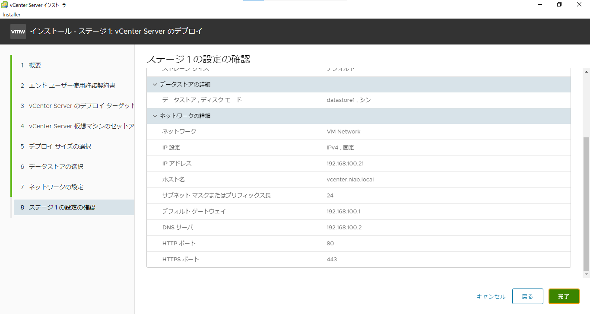
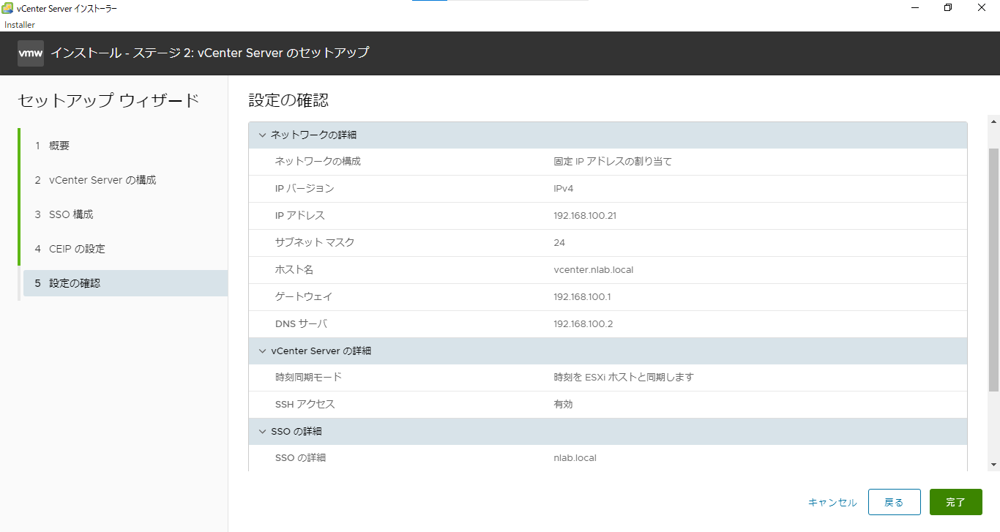

# vCenter
## 概要
- 実験日: 2022/09/23,2022/09/30
- vCenter

目次
- [vCenter](#vcenter)
  - [概要](#概要)
  - [1. vCenterとは](#1-vcenterとは)
  - [2. vCenterの特徴](#2-vcenterの特徴)
  - [3. vCenterの手順](#3-vcenterの手順)

## 1. vCenterとは
- vCenter Serverとは､複数のEsxiを束ねて1つの管理画面にて操作することを可能にする統合管理プラットフォーム

## 2. vCenterの特徴

## 3. vCenterの手順

- vCenterをVMwareからダウンロードする｡

- ダウンロードフォルダなどに保存したISOイメージをマウントする｡

- マウントされた中の`VMware VCSA/vcsa-ui-installer/win32/install.exe`ファイルを実行する｡

stage1の概要

- vCenter Serverのデプロイターゲット欄には､ダウンロード先には､[Esxiのホスト](./00-VM-Network-Overview.md)ユーザ名=`root`、パスワード=`P@ssw0rd`を入力する

- vCenter Serverの仮想マシンのセットアップ欄では､仮想マシン名やrootパスワードを入力する｡

- 自分の環境に適したサイズを選択する。今回の場合は、実験用のため最小を選択する。

- vCenterを入れるデータストアを選択する。

- vCenter自身のFQDN = `esxi4.nlab.local`､vCenterのipアドレス=`192.168.100.21`、サブネットマスク=`255.255.255.0`、デフォルトゲート=`192.168.100.1`、DNSサーバー=`192.168.100.1`を入力した｡

- ステージ１のインストールが終了するとステージ２の設定をする

- 今回の実験(20221014以前までの実験)では､DNSを利用していないため名前解決をする必要がある｡

- vCenterを入れている192.168.100.21に対してssh接続を有効にする｡
- vCenterを入れている192.168.100.21に対してログインを行いvCenterを起動させる｡
- アプライアンスシェルが起動されるため`shell`コマンドを入力しBashのようなものにする必要がある｡
- 以降は[VM実験環境概要 2.](./00-VM-Network-Overview.md)を参照することで設定することができる｡

- vCenter Serverの時刻同期欄には､NTPを利用しないため選択しない｡
- SSO構成欄には､Single-Sign-Onドメイン名=`nlab.local`､Single-Sign-Onパスワード=`P@ssw0rd`を入力する｡

- ステージ2のインストールが完了するとログインする｡

- esxi4.nlab.localを検索し､ユーザー名 = `administrator@nlab.local`､パスワード=`P@ssw0rd`を入力しログインを行う｡

これではうまく行かないことから20221014の実験から､NAT及びNTPを新たに作成する｡

