# vSAN
## 概要
- 実験日: 2022/09/23
- vSAN

目次
- [vSAN](#vsan)
  - [概要](#概要)
  - [1. 今回の実験](#1-今回の実験)
  - [2. vSANとは](#2-vsanとは)
    - [2.1 SANとは?](#21-sanとは)
    - [2.2 DAS NAS SAN　の違い](#22-das-nas-sanの違い)
    - [2.3 主なSANの接続方法について](#23-主なsanの接続方法について)
    - [2.4 Fibre Channelのデメリット](#24-fibre-channelのデメリット)
    - [2.5 iSCSIのメリット](#25-iscsiのメリット)
    - [2.6 仮想化基盤の特徴について](#26-仮想化基盤の特徴について)
  - [3. vSAN構築手順](#3-vsan構築手順)
  - [4. 補足](#4-補足)
    - [ブロックストレージとファイルストレージの違い](#ブロックストレージとファイルストレージの違い)
    - [キャッシュ層とキャパシティ層の違い](#キャッシュ層とキャパシティ層の違い)
    - [キャッシュ層とキャパシティ層の注意点](#キャッシュ層とキャパシティ層の注意点)
  - [5. まとめ](#5-まとめ)

## 1. 今回の実験
&nbsp; 今回の実験では､研究室の環境([詳細はこちら](./00-VM-Machines.md))を利用して､vSANの構築を目指した｡ 

&nbsp; 目的として､vSANに至るまでの歴史からvSANの設定方法について理解することである｡
## 2. vSANとは
- ストレージ仮想化ソフトウェアの1つ
- HCIにて､SANの機能を仮想化したもの
### 2.1 SANとは?
&nbsp; ストレージとサーバー間に対して､専用のネットワークを構築し接続することによって､高効率化や冗長化などを目的としたストレージに対する接続形態の1つ｡ 

　
&nbsp; 1つのストレージに対して､複数のサーバー情報を保存することができるため､最大限のリソースを利用することが可能になる｡また､サーバーが停止した際には､ストレージと接続している別のサーバーにアプリケーションを移すことができる｡そのため､耐障害性の問題を低減することができる｡

### 2.2 DAS NAS SAN　の違い
&nbsp; SAN以外にもDASやNASが存在する｡それぞれの違いについて表を以下に示す｡

|| DAS | NAS | SAN |
|:----| :---- | :---- | :---- |
| 特徴 | ･ブロックストレージ ･サーバーとストレージの直接接続|･ファイルストレージ ･同じLAN内に設置しサーバーとストレージを接続|･ブロックストレージ ･ストレージ専用のネットワークを構築しサーバーとストレージを接続|
|メリット|単純な構成|SANより単純な構成|他の2つの接続形態より､最大限のリソースを利用可能になる|
| デメリット | ･ホスト数の数だけストレージが必要である点 ･ストレージが分散されることで把握が困難になる点|･同じLAN内のため､通信が混み合っている際は､スループット低下に直結する点 |･1つのストレージに複数のVMを入れることになるため管理が難しい ･専用のネットワークを構築する必要からコストが他の2つと比較して高い点|

- [ブロックストレージとファイルストレージの違い](#ブロックストレージとファイルストレージの違い)

### 2.3 主なSANの接続方法について

- **Fibre Channel**
- **iSCSI**

### 2.4 Fibre Channelのデメリット 
  - FC専用のルータやスイッチなどを購入する必要があるため高価
  - FC専用ネットワークを構築する必要がある
  - 専用のルータなので設定が難しい
  - メンテナンスコストが高い

### 2.5 iSCSIのメリット
  - 専用品を必要としないため経費を抑えられる点
  - FC専用ネットワークの構築に労力を掛ける必要がない点
  - iSCSIのパケットは､TCP通信で行われることから通信をすべてIPに統合できるため管理を容易にすることができる点
  - TCPパケット内には､SCSIコマンドが入っているため通信エラーなどの問題の際には確認しやすい

### 2.6 仮想化基盤の特徴について

  - **3Tier**
    - 物理サーバー及びSAN､共有ストレージ装置の3層構造担っている｡
    - 3層それぞれ異なるメーカの機器を組み合わせることができるため自由に増設可能な点｡
    - 製品ごとのソフトウェアが異なるため設定するのが困難な点
    - 組み合わせによって､動作確認ができてない製品がある点
  - **CI**
    - パッケージ化された物
    - 要件定義を細かく決定していないと増設の際にすべての設定を見直す必要があるため難しい
  - **HCI**
    - サーバー及びストレージネットワーク､ストレージプールの3層構造になっている｡
    - 3層構造にてソフトウェア上で接続する
    - **仮想的にSANをソフトウェア上で構成することをvSANという**
## 3. vSAN構築手順

1. ログイン
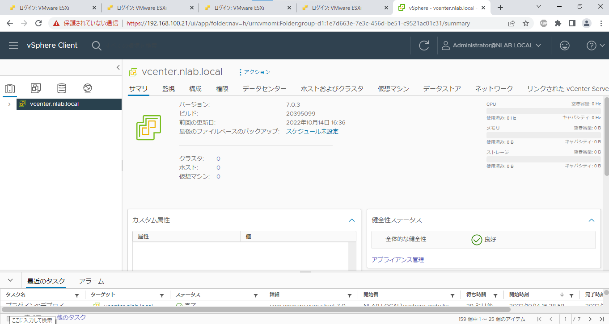
*図1 vSphere Clientログイン時の初期画面*

2. vcenter.nlab.localをクリックし､新規データセンターを作成する｡今回は､名前 = `Datacenter`をつける｡
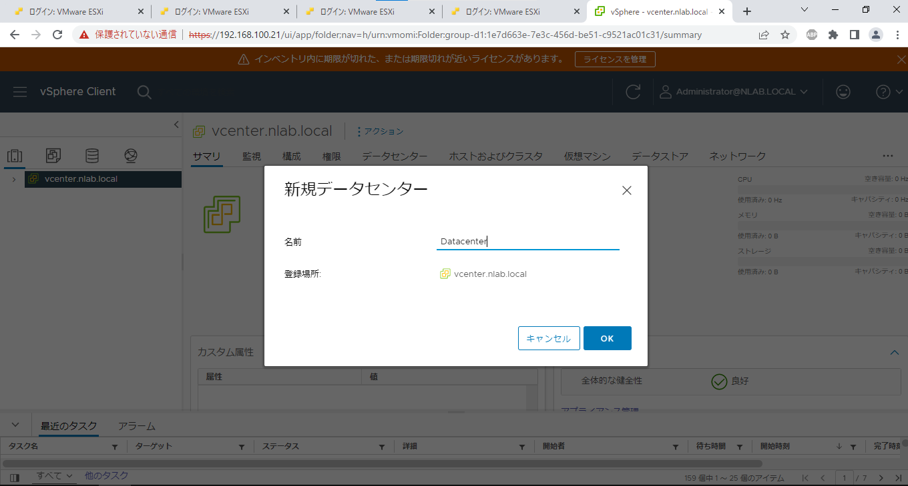
*図2 新規データセンター作成* 

3. 作成されたDatacenterを右クリックしホストを追加する｡それぞれのホストを1つのまとまりとして認識し､様々なサービスを可能にする｡

4. 名前と場所では､vCenter Serverがインストールされているホスト名またはIPアドレス = `192.168.100.12`を入力する｡

5. 接続設定欄ではユーザー名 = `root` パスワード = `password`を入力する｡

6. ホストサマリにて設定した情報を確認する｡
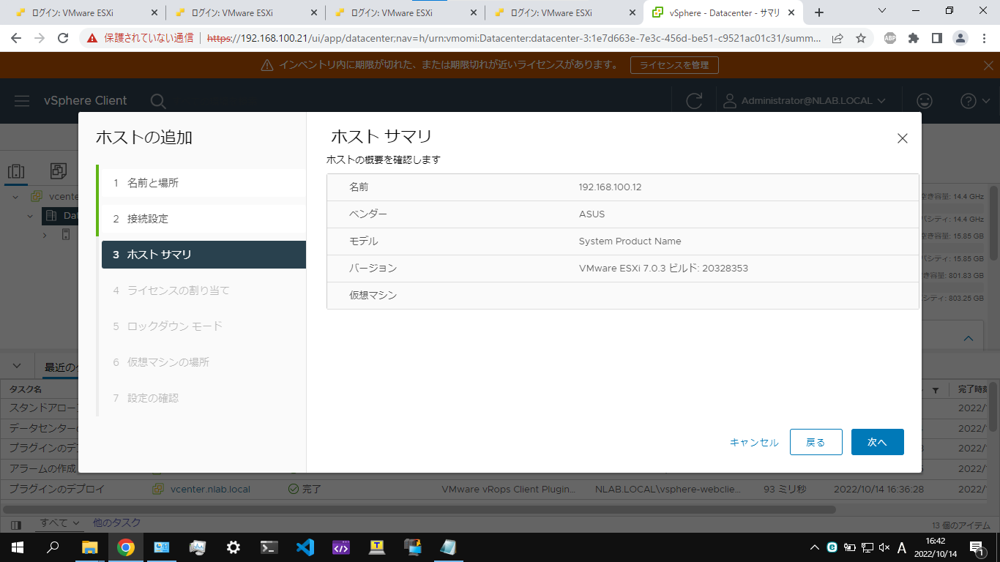
*図3 ホストの追加 ホストサマリ*

7. ライセンスの割り当て欄では､ライセンスを持っているためLicense1が表示されている｡License1を選択する｡

8. ロックダウンモード及び仮想マシンの場所はデフォルトのまま設定する｡

9. 設定した情報を確認する
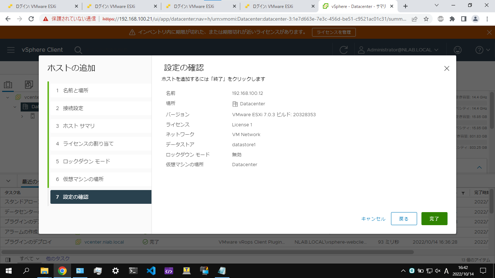
*図4 ホストの追加 設定の確認*

10. EsxiがDatacenter内にあることを確認する｡その後､他の2台を同じように設定する｡その後､Datacenter内に､ホストが3台分入っていることを確認する｡

11. 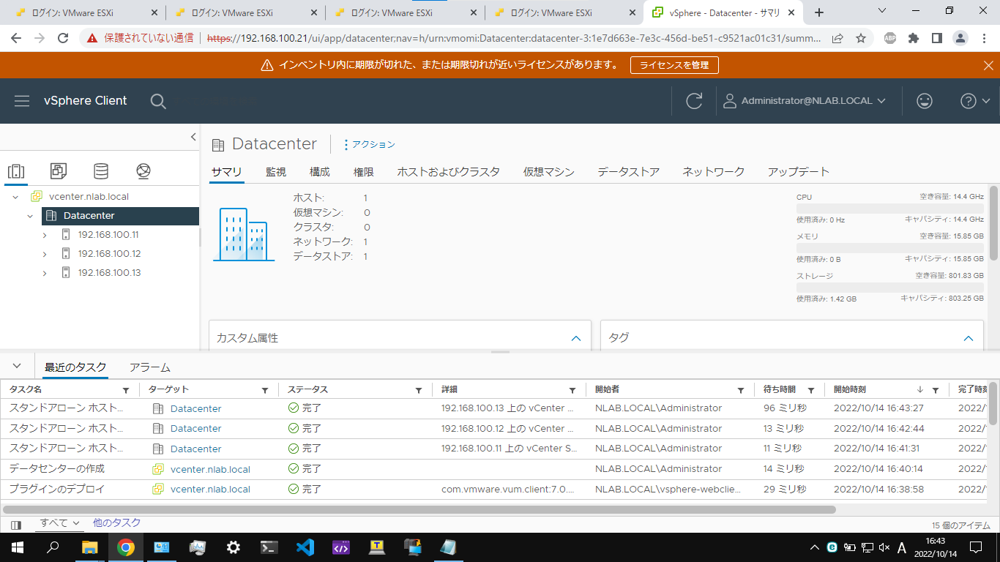
*図5 管理画面にてDatacenter及びホストの確認*

12. Datacenterにて､右クリックを押し新規クラスタを作成する｡クラスタを作成しvSANを構築することで､負荷に偏りがある際にvMotionなどのサーバー間で展開しているアプリケーションを移動することが可能になる｡

13. 基本欄では､名前 = `Cluster`､vSANを`ON`にする｡

14. Clusterを押し､構成欄のクイックスタートからホストの追加を選択する｡
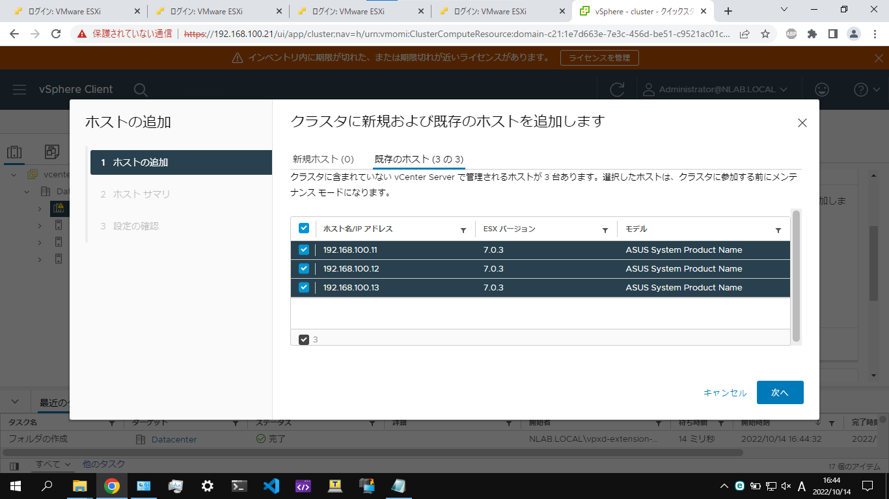

15.  クラスタの構成をクリックし､ディスクの要求 vSANデータストア欄では､SSDをキャッシュ層に､HDDをキャパシティ層といったように､ホスト1から3までに対して設定する｡
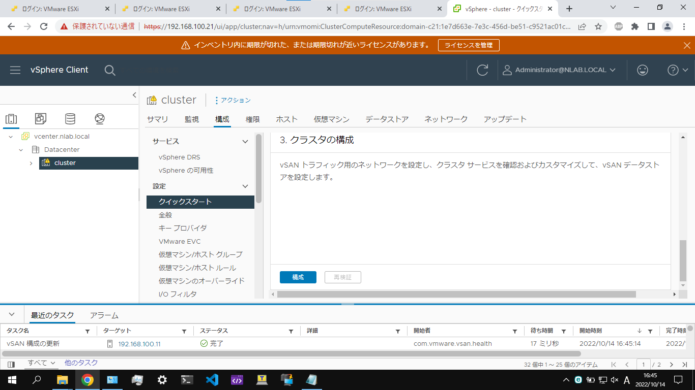
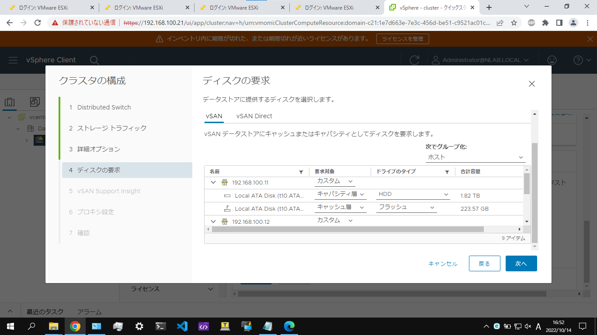
16. クラスタ構成の確認画面にてvSANデータストア内のvSANディスクグループタイプ及びキャッシュサイズ､容量サイズについて確認する｡
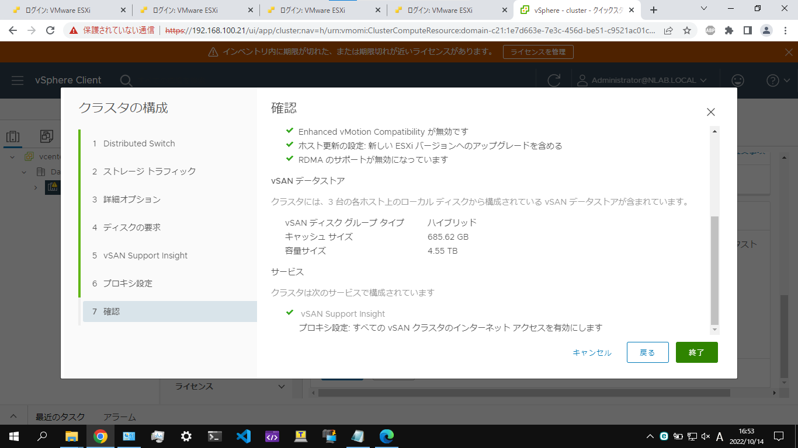
17. クラスタ画面に戻り､最近のタスクにてターゲット=`cluster`のステータスが`完了`になっていれば､正常に処理が終わっている｡
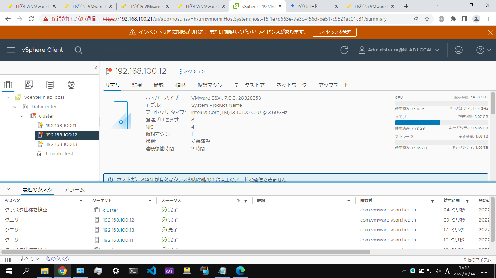

## 4. 補足

### ブロックストレージとファイルストレージの違い
- ブロックストレージ:ストレージ領域を貼る範囲に切り出してブロックにして管理し割り当てる｡
- ファイルストレージ:ファイルやディレクトリにて階層的に管理する｡
### キャッシュ層とキャパシティ層の違い
- キャッシュ層:I/Oの処理を担う
- キャパシティ層:データの保存を担う
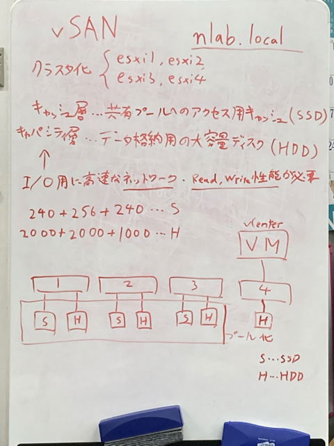
### キャッシュ層とキャパシティ層の注意点
- vSANを構築するためには、キャッシュ層つまり実行容量にカウントされないストレージデバイスが1台以上必要である｡そのため､高速な読み書きが可能なSSDを利用する。
- HDDをキャッシュ層にすることはできない｡

## 5. まとめ
- vSANとは､ストレージ仮想化ソフトウェアである｡
- vSAN以外にも様々なストレージに対する接続形態が存在するが､事業規模に応じて変更する必要がある｡
